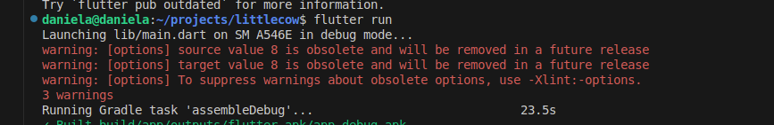

# Guia de instalacion
## Instalacion de Visual Studio Code (VS Code)
- Descarga oficial: [VS Code Download ](https://code.visualstudio.com/download)
- Instalación en Ubuntu (App Center):
    - Abre la Ubuntu Software (App Center).
    - Busca "Visual Studio Code".
    - Haz clic en "Instalar".
## Instalacion de Android Studio
### Requisitos Previos
Antes de instalar Android Studio, necesitas instalar algunas dependencias:
```bash
$ sudo apt-get install libc6:amd64 libstdc++6:amd64 lib32z1 libbz2-1.0:amd64
```
### Instalación manual paso a paso
#### Paso 1: Descargar Android Studio:
- Ve a https://developer.android.com/studio
- Haz clic en "Download Android Studio" para Linux
#### Paso 2: Extrae el archivo:
Para el usuario 
```bash
$ tar -xzf android-studio-*.tar.gz -C ~/development/
```
#### Paso 3: Inicia la instalación
```bash
$ ~/development/android-studio/bin/studio.sh 
```
#### Paso 4: Configuración Inicial (Setup Wizard)
- Tipo de instalación:
    - Elige "Custom" para seleccionar componentes manualmente.
- SDK Components Setup:
    - Ubicación del SDK:
        - Por defecto: ~/Android/Sdk/
        - Personalizada (ej: ~/development/android-sdk/).
    - Componentes esenciales:
        - Android SDK Platform (API 33)  
        - Android SDK Command-line Tools  
        - Android SDK Build-Tools  
        - Android SDK Platform-Tools  
        - Android Emulator
#### Paso 5: Configurar Variables de Entorno
1. Edite el archivo `.bashrc`:
```bash
$ nano ~/.bashrc
```
2. Añade al final:
```bash
export ANDROID_HOME="$HOME/development/android-sdk"  # o tu ruta personalizada
export PATH="$PATH:$ANDROID_HOME/platform-tools"
export PATH="$PATH:$ANDROID_HOME/tools"
export PATH="$PATH:$ANDROID_HOME/cmdline-tools/latest/bin"
```
3. Aplique los cambios:
```bash
$ source ~/.bashrc
```
#### Paso 6: Verificar Instalación
```bash
adb --version  
```
#### Paso 7: Crear Acceso Directo (Opcional)
Para añadir Android Studio al menú de aplicaciones:
```bash
$ sudo nano /usr/share/applications/android-studio.desktop
```
Pegue
```bash
[Desktop Entry]
Version=1.0
Type=Application
Name=Android Studio
Exec=/home/tu_usuario/development/android-studio/bin/studio.sh
Icon=/home/tu_usuario/development/android-studio/bin/studio.png
Categories=Development;IDE;
Terminal=false
```
## Instalacion de Flutter
### Requisitos Previos
1. Actualización del Sistema
Antes de comenzar, asegúrese de tener su sistema actualizado:
```bash
$ sudo apt-get update -y && sudo apt-get upgrade -y
```
2. Instalación de Dependencias: 
Instale los siguientes paquetes esenciales:
```bash
$ sudo apt-get install -y curl git unzip xz-utils zip libglu1-mesa clang cmake ninja-build libgtk-3-dev
```
### Instalacion del SDK de Flutter
#### Paso 1: Configuración de VS Code
1. Abra Visual Studio Code (code).
2. Instale las siguientes extensiones:
    - Flutter (oficial)
    - Dart (oficial)
#### Paso 2: Descarga del SDK desde VS Code
1. Abra la paleta de comandos `(Ctrl + Shift+ P)`.
2. Busque y seleccione: "Flutter: New Project".
3. VS Code solicitará que seleccione la ubicación del SDK:
    - Si ya tiene Flutter instalado, seleccione "Locate SDK". 
    - Si no, elija "Download SDK".
#### Paso 3: Directorio de Instalación
- Se recomienda instalar Flutter en una ruta estándar como:
    - ~/development/flutter
    - ~/dev/flutter
- Seleccione "Clone Flutter" para iniciar la descarga.
- Reinicie VS Code al finalizar.
#### Paso 4: Configuracion de Variables de Entorno
1. Edite el archivo `.bashrc`:
```bash
$ nano ~/.bashrc
```
2. Agregue la siguiente línea al final (ajuste la ruta según su instalación):
```bash
export PATH=$PATH:$HOME/development/flutter/bin
```
3. Aplique los cambios:
```bash
$ source ~/.bashrc
```
#### 5. Verificación de la Instalación
Ejecute el siguiente comando para confirmar que todo esté correcto:
```bash
$ flutter doctor
```
Este comando identificará dependencias faltantes o configuraciones pendientes. Siga las recomendaciones que aparezcan para completar la instalación.
#### 6. Aceptar Licencias de Android SDK
Si hay licencias pendientes, verás un mensaje como:
```bash
[!] Android toolchain - develop for Android devices
    ✗ Android licenses not accepted. To resolve this, run: flutter doctor --android-licenses
```
1. Acepta las licencias:
```bash
$ flutter doctor --android-licenses
```
2. Aceptar cada licencia presionando y + Enter.
3. Verifica que todas fueron aceptadas:
``` bash
flutter doctor
```
La salida correcta debe mostrar:
```bash
[✓] Android toolchain - develop for Android devices (Android SDK version X.X.X)
    • All Android licenses accepted.
```
## Errores y Advertencias

### Advertencias de JDK obsoleto

Captura de advertencia


