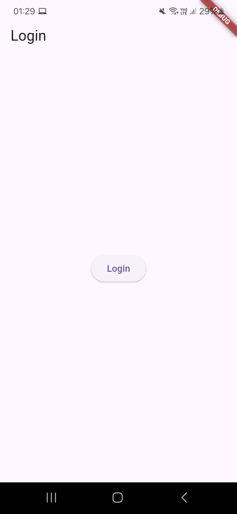
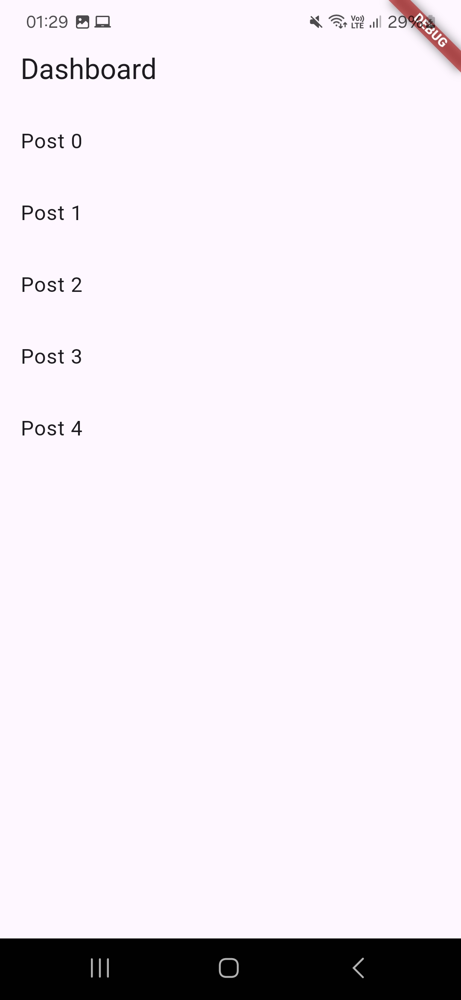

# LittleCow 
## Entorno de desarrollo
| Componente| Version | 
|----------|----------|
| Flutter    |  3.29.2  | 
| Dart    | 3.7.2   | 
| Android Studio    | 2024.3 | 
| Android SDK  | 35.0.1 | 
---
## Instalación Detallada
Todos los pasos técnicos están en:  
[**INSTALL.md**](INSTALL.md)

## Ejecución del Proyecto
Sigue estos pasos para configurar y ejecutar el proyecto localmente:
```bash
# 1. Clonar repositorio
git clone https://github.com/jokoframework/littlecow.git
cd littlecow

# 2. Limpiar el proyecto 
flutter clean

# 2. Instalar dependencias
flutter pub get

# 3. Ejecutar (usar tu dispositivo conectado o emulador)
flutter run
```
## Capturas de Pantalla

### Pantalla de Login


### Listado de Posts


