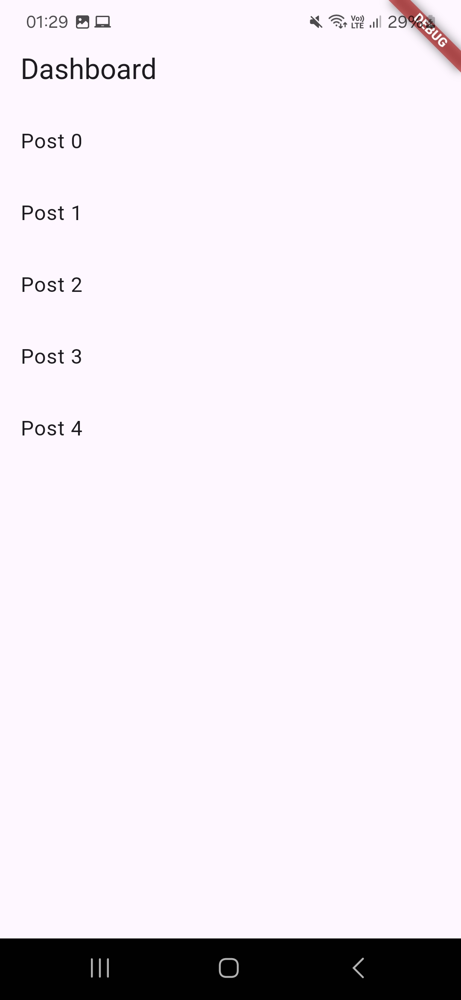

# LittleCow 
## Entorno de desarrollo
| Componente| Version | 
|----------|----------|
| Flutter    |  3.29.2  | 
| Dart    | 3.7.2   | 
| Android Studio    | 2024.3 | 
| Android SDK  | 35.0.1 | 

## Instalación Detallada
Todos los pasos técnicos están en:  
[**INSTALL.md**](INSTALL.md)

## Ejecución
```bash
# 1. Clonar repositorio
git clone https://github.com/tu-usuario/proyecto.git

# 2. Instalar dependencias
flutter pub get

# 3. Ejecutar (usar tu dispositivo conectado o emulador)
flutter run
```
## 📸 Capturas

### Pantalla de Login


### Listado de Posts
